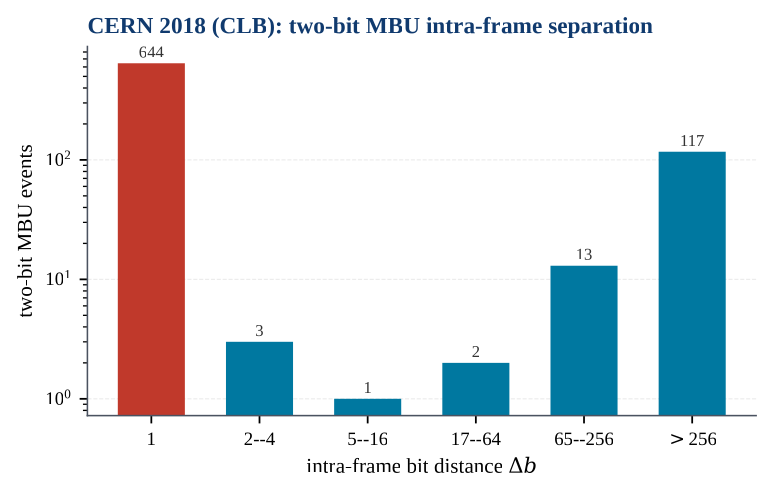

# fpga-config-scrubber

A two-dimensional configuration-memory scrubber for the Xilinx Zynq-7000. It was completed,
characterised on silicon and hardened as John Vrachnis's MSc thesis at the University of
Piraeus (supervisor: Prof. Mihalis Psarakis). The scrubber architecture and most of the IP core
are by Dr. Vasileios Vlagkoulis (SYSYFOS project, University of Piraeus, 2019–2021). The
[Credits](#authorship-and-credits) section lists who did what.

> **Contents at a glance.** This repository holds John's part of the work: the ICAP
> controller, the 2026 hardening RTL, the closed-loop testbench, about 190 Vivado/xsdb
> campaign scripts, the silicon findings, and the 2018–19 beam-data analysis pipeline. The
> inherited SYSYFOS RTL is **not** included (see [Not included](#not-included)), so the core
> does not build from this repository alone.

## Why

An SRAM FPGA stores the circuit itself in configuration memory. A heavy-ion strike that flips
one of those bits silently rewires the design, and the error stays until something rewrites
the frame. The device's built-in Frame-ECC is a SECDED code per 3,232-bit frame. It corrects
single-bit upsets and detects doubles. When 3 or more bits flip in one frame (an odd number),
it can point at the *wrong* bit and write a new error.

Replaying the CERN 2018 heavy-ion data through a model of ECC-only scrubbing gives 198
mis-corrected frames out of 32,691 upset-bearing frames. Those multi-bit upsets are mostly
spatially adjacent bits. A second, interleaved parity dimension turns them into independently
correctable errors.

## Method

- **Device.** xc7z010 on a Digilent Zybo Z7-10 (IDCODE `0x13722093`). A frame is 101 words ×
  32 bits. The scrubbed range is 94 CLB columns and 3,250 frames. The column geometry was
  measured with an ILA and is in `devicefiles/` and `rtl/v1.8/device_geometry_pkg.vhd`.
- **Horizontal code.** The device's own per-frame Hamming ECC (`FRAME_ECCE2`), read on every
  frame the scrubber reads back through `ICAPE2`.
- **Vertical code.** Interleaved parity per configuration column. The subgroup is
  `minor mod S`, and the parity frame `P[g,s][w][b]` is the XOR of every frame in subgroup s.
  A golden copy is built at start-up (under 15 ms) and kept in block RAM. At run time,
  `golden XOR current` is exactly the error pattern of a frame that is the only errored frame
  in its subgroup, at any multiplicity. S and the group window G are generics, validated at
  (S, G) = (2, 64), (4, 64) and (4, 128).
- **Correction.** A decision tree over the stored syndromes. There are three cases:
  1. A frame that is the only errored frame in its subgroup is rebuilt from parity.
  2. An odd-multiplicity frame is corrected at its ECC-decoded position, but only if the
     parity confirms that bit.
  3. The remaining frames are resolved subgroup by subgroup.

  Fixes are written back by read, merge and write through the ICAP. The per-sweep limit is
  one even-multiplicity frame per subgroup.
- **System.** One `ICAPE2` is shared by the scan/parity path, the corrector and a fault
  injector through a rotating-priority arbiter. The ARM reaches the core over AXI4-Lite at
  `0x43C0_0000`. After one sync kick the core runs autonomously.
- **What 2026 added (John).**
  - Toolchain and scan: a port to Vivado 2025.2 and the missing continuous-scan driver.
  - Correctness: eight RTL defect fixes, found with ILA captures on silicon and a closed-loop
    GHDL bench (`sim/core_tb/`) that models ICAPE2, configuration memory and Frame-ECC with
    ILA-calibrated timing.
  - Hardening, four layers: safe-state FSMs, byte parity on the golden store, TMR with
    feedback voters, and a progress watchdog that keeps the golden reference across its reset.
  - Beyond-capacity handling: mark-and-skip for groups the code cannot correct.
  - Verification: every silicon campaign in `campaign/`.
- **Design input.** The interleave was chosen from John's analysis of 46,812 CLB upsets from
  CERN 2018 and 7,337 from GSI 2019 (`analysis/beam/`).

## Key results

All results come from one Zybo Z7-10 board at room temperature, with upsets planted by the
on-chip injector. The completed design has **not** been beam-tested. Sources are the
`FINDINGS.md` files under `campaign/`, where §13 onward is the final state.

| Metric | Result |
|---|---|
| Timing / area, hardened core, S2G64 | WNS **+1.12 ns** at 100 MHz; 1,613 LUT, 1,746 FF, 37 RAMB18 |
| Correction latency (hardware counter) | **60 µs median, 88 µs max** on the final builds (the earlier Aug-28 build measured 36 µs mid-column and 40 µs column-last) |
| Full sweep | About **6 ms**, after a geometry-aware scan replaced a linear scan that took 2.127 s |
| Detection latency | 5 ms median / 8 ms max (was 2,013 / 2,133 ms) |
| Randomised campaign, 150 reachable single-bit vectors, "honest" verdict (detected, corrected, no golden re-init, no watchdog fire) | **147/150**; 146–147/150 on the production build and 147/150 twice on S4G64 in the final night run. Two vectors never land, so the ceiling is 148/150. |
| Earlier acceptance runs (first-detection criterion) | First injection after start **5/5**; double-injection stress over 14 frames in both halves **28/28**; 12-injection campaign **12/12**. Read these together with the honest 147/150 above. |
| Replay of real multi-frame beam events on silicon | S = 2: **299/300** and 354/355. S = 4: **300/300**. |
| Self-upset: flipping essential bits of the scrubber's own frames | 85–89 % healed; fatal about 6 % with the watchdog on and 4 % with it off. 303 directed supervised trials with 0 failed recoveries (re-program in about 4.3 s). |
| Capacity | N single-bit upsets in N columns (N ≤ 16) all corrected in one pass. Two even-multiplicity frames in the same subgroup are **not** corrected; mark-and-skip masks such a group instead of livelocking. |

**Coverage model on the real beam data** (`campaign/2026-09-03_matrix/coverage_by_S.csv`). This
model is pessimistic: it uses the 40.8 s beam readback interval as the coincidence window.

| Configuration | CERN 2018 (32,691 frames) | GSI 2019 (7,101 frames) |
|---|---|---|
| Frame-ECC only (SEM-like) | 96.66 %, 198 mis-corrected | 98.48 %, 2 mis-corrected |
| Vertical parity only, S = 2 | 89.79 % | 69.00 % |
| **Both, S = 2** | **99.80 %**, 0 mis-corrected | **100 %** |
| Both, S = 4 | 100 % | 100 % |

**Beam-data findings.** 82.6 % of two-bit CLB MBUs at CERN (644 of 780) are adjacent bits. At
GSI only 2 of 103 are, so the adjacency result holds for CERN only. The MBU share rises from
2.9 % at normal incidence to 7.2 % at 45°. The aggregate figures are in `docs/figures/`.



**Negative results worth knowing** (details in FINDINGS):

- An early "150/150" campaign had detected only 2 upsets and was withdrawn.
- A watchdog rebuilt golden parity from already-corrupted memory.
- The scan walked about 2.1 M non-existent frame addresses.
- The scrubber's own AXI interconnect FIFO causes every bus hang when its frames are
  rewritten.
- One four-frame replay in bottom column 19 remains unexplained.

## Repository layout

| Path | What |
|---|---|
| `rtl/` | John's RTL and a description of the inherited blocks (`rtl/README.md`) |
| `sim/core_tb/` | Closed-loop testbench of the whole `scrubber_ip`: behavioural ICAPE2 + configuration memory + Frame-ECC. `run_matrix.sh` runs every (S, G) configuration. |
| `sim/injector_tb/` | Self-checking bench of the ICAP controller and injector |
| `vivado/` | Build, ILA-insertion and xsdb campaign scripts. `vivado/README.md` marks the current ones. |
| `campaign/` | Dated `FINDINGS.md` write-ups, the configuration matrix, the injectable-frame map and the coverage table |
| `devicefiles/` | Measured xc7z010 column map and Frame-ECC FAR sequence |
| `docs/` | Engineering log (`HARDWARE_BRINGUP_2026.md`), hardening survey and record (`HARDENING_RESEARCH.md`), figure script, aggregate beam figures |
| `analysis/beam/` | 2018–19 beam-data pipeline (upset database, pattern mining) and the 2026 coverage model |
| `prototypes/` | John's 2019 ICAP and fault-injection prototypes |

## How to run

The pieces that run from this repository alone:

```bash
# Coverage model / figures (needs the beam upset database, not included)
BEAM_ROOT=/path/to/beam-analysis python3 docs/cernfigs_pro.py
cd /path/to/beam-analysis/temp && python3 /path/to/repo/analysis/beam/coverage.py --csv
```

These need the inherited RTL placed under `rtl/` at the paths the scripts list:

```bash
cd sim/core_tb && ./run_matrix.sh          # GHDL (VHDL-2008); all (S,G) configs
export SCRUBBER_ROOT=$PWD VIVADO_BIN=<Xilinx>/2025.2/Vivado/bin
$VIVADO_BIN/xsdb vivado/campaign_honest.tcl   # needs a programmed Zybo Z7-10
```

Bring-up on the board (from xsdb, after programming and `ps7_init`):

```tcl
mwr 0xF8007000 0x4600E07F                 ;# devcfg: hand PCAP -> ICAP (mandatory)
mwr 0x43C0000C 0x1; mwr 0x43C0000C 0x7    ;# sync kick
mrd 0x43C00010                            ;# bit0 synced; [15:8] scan counter advancing
```

Tools used: AMD Vivado 2025.2 (ML Standard), GHDL, xsdb, and Python 3 with pandas and
matplotlib.

## Data

The heavy-ion data is **not** redistributed. Its sharing terms belong to the collaboration
that obtained the beam time, so this repository contains only aggregate statistics and
figures.

- **CERN 2018:** SPS North Area, ultra-high-energy heavy ions, xc7z020, readbacks at 0° and
  45°. The upset database has 89,487 records (46,812 CLB).
- **GSI 2019:** GSI Helmholtz Centre, Darmstadt. The upset database has 11,424 records (7,337
  CLB).

If you use these results, cite V. Vlagkoulis et al., IEEE TNS 68(1), 2021
(doi:[10.1109/TNS.2020.3033188](https://doi.org/10.1109/TNS.2020.3033188)). On the beams
themselves, see R. García Alía et al., IEEE TNS 66(1), 2019
(doi:[10.1109/TNS.2018.2883501](https://doi.org/10.1109/TNS.2018.2883501)) and M. Kastriotou
et al., IEEE TNS 67(1), 2020 (doi:[10.1109/TNS.2019.2961801](https://doi.org/10.1109/TNS.2019.2961801)).

The silicon campaign data (`campaign/`, `devicefiles/`) was produced by the author on his own
board.

## Publications

Papers co-authored by John Vrachnis in this line of work:

1. V. Vlagkoulis, A. Sari, **J. Vrachnis**, G. Antonopoulos, N. Segkos, M. Psarakis,
   A. Tavoularis, G. Furano, C. Boatella Polo, C. Poivey, V. Ferlet-Cavrois, M. Kastriotou,
   P. Fernández Martínez, R. García Alía, K.-O. Voss, C. Schuy, "Single Event Effects
   Characterization of the Programmable Logic of Xilinx Zynq-7000 FPGA Using Very/Ultra
   High-Energy Heavy Ions," *IEEE Transactions on Nuclear Science*, vol. 68, no. 1,
   pp. 36–45, Jan. 2021. doi:[10.1109/TNS.2020.3033188](https://doi.org/10.1109/TNS.2020.3033188)
2. V. Vlagkoulis, M. Psarakis, A. Sari, **J. Vrachnis**, G. Antonopoulos, A. Tavoularis,
   G. Furano, C. Boatella Polo, C. Poivey, V. Ferlet-Cavrois, M. Kastriotou,
   P. Fernández Martínez, R. García Alía, "Configuration Memory Scrubber for the Xilinx
   Zynq-7000 FPGA based on a 2D coding scheme," *SEFUW: SpacE FPGA Users Workshop, 5th
   Edition*, ESA/ESTEC, Noordwijk, Mar. 2020 (presentation).
   [indico.esa.int/event/328/contributions/5383](https://indico.esa.int/event/328/contributions/5383/)
3. V. Vlagkoulis, A. Sari, **J. Vrachnis**, G. Antonopoulos, N. Segkos, M. Psarakis, "Analysis
   of the Single Event Upsets in the Programmable Logic of 28 nm Xilinx Zynq-7000 FPGA due to
   Heavy Ion Irradiation," *SEE/MAPLD 2019*, San Diego, CA, May 2019 (presentation).
   [seemapld.org archive](https://www.seemapld.org/archive/2019/0522_WED/1040%20-%20SEE-MAPLD19_Psarakis_Zynq_Radiation.pdf)

The scrubber architecture as published by the SYSYFOS group (John is not an author of these):

4. V. Vlagkoulis, A. Sari, J. Proko, D. Zografakis, M. Psarakis, A. Tavoularis, G. Furano,
   C. Boatella-Polo, C. Poivey, V. Ferlet-Cavrois, M. Kastriotou, P. Fernández Martínez,
   R. García Alía, "Configuration Memory Scrubbing of the Xilinx Zynq-7000 FPGA using a Mixed
   2-D Coding Technique," *Proc. RADECS 2019*, Montpellier, pp. 1–4.
   doi:[10.1109/RADECS47380.2019.9745693](https://doi.org/10.1109/RADECS47380.2019.9745693)
5. V. Vlagkoulis, A. Sari, G. Antonopoulos, M. Psarakis, A. Tavoularis, G. Furano,
   C. Boatella-Polo, C. Poivey, V. Ferlet-Cavrois, M. Kastriotou, P. Fernández Martínez,
   R. García Alía, "Configuration Memory Scrubbing of SRAM-Based FPGAs Using a Mixed 2-D Coding
   Technique," *IEEE Transactions on Nuclear Science*, vol. 69, no. 4, pp. 871–882, Apr. 2022.
   doi:[10.1109/TNS.2022.3151977](https://doi.org/10.1109/TNS.2022.3151977)

The publisher versions are copyright IEEE and are linked, not copied. The MSc thesis is J.
Vrachnis, *An Internal Configuration-Memory Scrubber for Xilinx Zynq-7000 FPGAs*, University
of Piraeus, 2026. The PDF will be added here once it is final. `CITATION.cff` has
machine-readable versions of all of the above.

## Authorship and credits

- **Architecture of the scrubber and the 2-D EDC algorithm; most of the IP core:**
  Dr. Vasileios Vlagkoulis (SYSYFOS project, University of Piraeus, 2019–2021). He was also
  technical supervisor of the thesis.
- **Supervision:** Prof. Mihalis Psarakis, University of Piraeus.
- **John Vrachnis:**
  - the ICAP controller, parity calculator and syndrome handler (2020), and the AXI fault
    injector and wrapper (2021);
  - the 2018 readback-parsing tools (`analysis/fdz/`);
  - the 2019 ICAP and fault-injection prototypes;
  - the 2018–19 beam-data pipeline;
  - and, in 2026: the port to Vivado 2025.2, the continuous-scan driver, the observability
    registers, the closed-loop bench, the RTL defect fixes, the parameterised geometry, the
    four hardening layers, mark-and-skip, every silicon campaign, and all documentation.
- **Other inherited code:** the generic dual-port RAM is by A. Tavoularis (TELETEL).
- **Collaboration:** the SYSYFOS project team at the University of Piraeus worked on the
  radiation campaigns and their analysis. The irradiations were performed at the
  CERN SPS North Area and at GSI within the collaborations acknowledged in the publications
  above.

`rtl/README.md` gives the per-file split.

## Not included

- **Inherited SYSYFOS RTL.** This covers the top level, arbiter, 2-D EDC, parity memories,
  FIFOs and the generic dual-port RAM, written by other SYSYFOS / TELETEL authors and not
  licensed by them for redistribution.
  `rtl/README.md` describes each block and the 2026 changes made to it.
- **Beam data.** No raw readbacks, per-upset records, pattern tables, netlists or mask files.
  The pattern-derived replay vector files (`vivado/replay_events*.tcl`) are also left out.
- **Build products.** No bitstreams, ILA probe files, Vivado projects, caches, timing or
  utilisation reports, or raw campaign logs and ILA capture CSVs. The FINDINGS summarise them.
- **Group-internal documents** (the internal specification and the original architecture
  drawing), the thesis PDF and defence slides (pending), internal review notes, and the
  scripts for unattended night runs.
